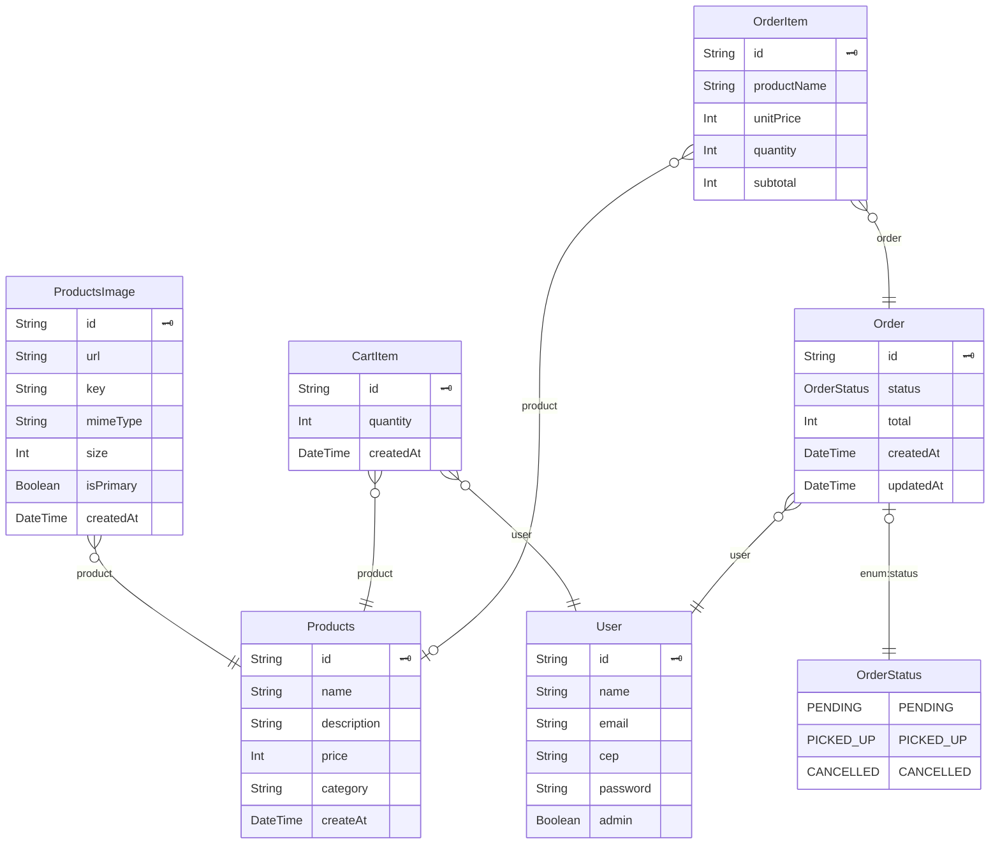

```mermaid
erDiagram

        OrderStatus {
            PENDING PENDING
PICKED_UP PICKED_UP
CANCELLED CANCELLED
        }
    
  "User" {
    String id "🗝️"
    String name 
    String email 
    String cep 
    String password 
    Boolean admin 
    }
  

  "Products" {
    String id "🗝️"
    String name 
    String description 
    Int price 
    String category 
    DateTime createAt 
    }
  

  "ProductsImage" {
    String id "🗝️"
    String url 
    String key 
    String mimeType 
    Int size 
    Boolean isPrimary 
    DateTime createdAt 
    }
  

  "CartItem" {
    String id "🗝️"
    Int quantity 
    DateTime createdAt 
    }
  

  "Order" {
    String id "🗝️"
    OrderStatus status 
    Int total 
    DateTime createdAt 
    DateTime updatedAt 
    }
  

  "OrderItem" {
    String id "🗝️"
    String productName 
    Int unitPrice 
    Int quantity 
    Int subtotal 
    }
  
    "ProductsImage" }o--|| "Products" : "product"
    "CartItem" }o--|| "Products" : "product"
    "CartItem" }o--|| "User" : "user"
    "Order" }o--|| "User" : "user"
    "Order" |o--|| "OrderStatus" : "enum:status"
    "OrderItem" }o--|| "Order" : "order"
    "OrderItem" }o--|o "Products" : "product"
```
