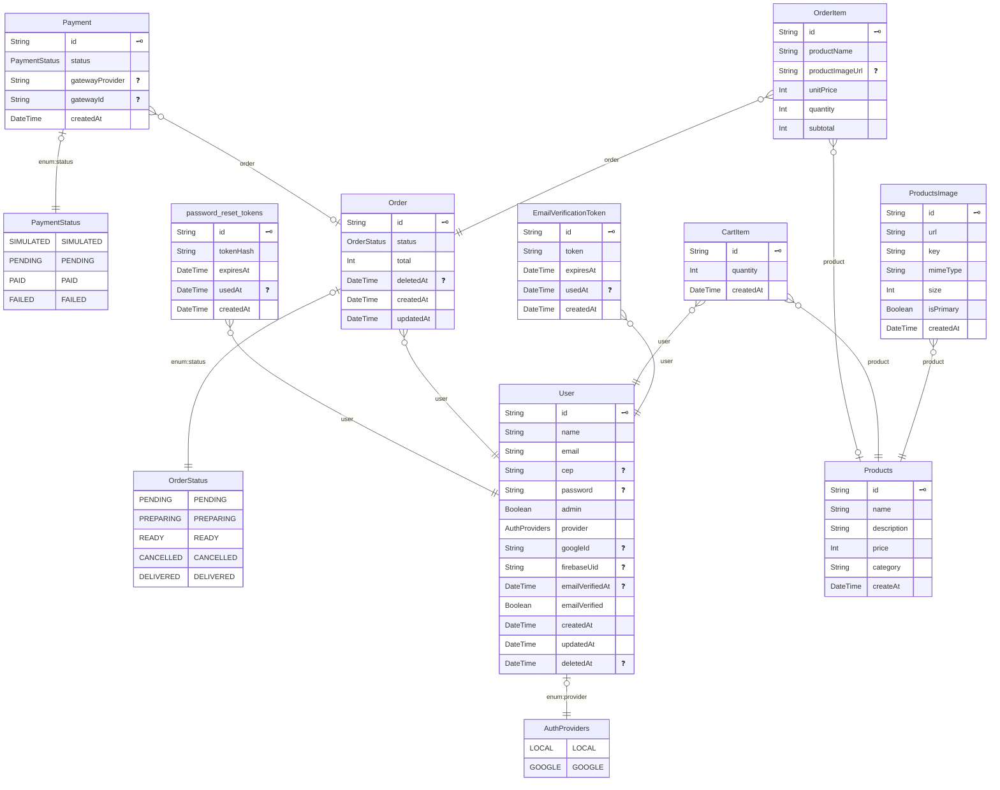

```mermaid
erDiagram

        AuthProviders {
            LOCAL LOCAL
GOOGLE GOOGLE
        }
    


        OrderStatus {
            PENDING PENDING
PREPARING PREPARING
READY READY
CANCELLED CANCELLED
DELIVERED DELIVERED
        }
    


        PaymentStatus {
            SIMULATED SIMULATED
PENDING PENDING
PAID PAID
FAILED FAILED
        }
    
  "User" {
    String id "🗝️"
    String name 
    String email 
    String cep "❓"
    String password "❓"
    Boolean admin 
    AuthProviders provider 
    String googleId "❓"
    String firebaseUid "❓"
    DateTime emailVerifiedAt "❓"
    Boolean emailVerified 
    DateTime createdAt 
    DateTime updatedAt 
    DateTime deletedAt "❓"
    }
  

  "EmailVerificationToken" {
    String id "🗝️"
    String token 
    DateTime expiresAt 
    DateTime usedAt "❓"
    DateTime createdAt 
    }
  

  "Products" {
    String id "🗝️"
    String name 
    String description 
    Int price 
    String category 
    DateTime createAt 
    }
  

  "ProductsImage" {
    String id "🗝️"
    String url 
    String key 
    String mimeType 
    Int size 
    Boolean isPrimary 
    DateTime createdAt 
    }
  

  "CartItem" {
    String id "🗝️"
    Int quantity 
    DateTime createdAt 
    }
  

  "Order" {
    String id "🗝️"
    OrderStatus status 
    Int total 
    DateTime deletedAt "❓"
    DateTime createdAt 
    DateTime updatedAt 
    }
  

  "OrderItem" {
    String id "🗝️"
    String productName 
    String productImageUrl "❓"
    Int unitPrice 
    Int quantity 
    Int subtotal 
    }
  

  "Payment" {
    String id "🗝️"
    PaymentStatus status 
    String gatewayProvider "❓"
    String gatewayId "❓"
    DateTime createdAt 
    }
  

  "password_reset_tokens" {
    String id "🗝️"
    String tokenHash 
    DateTime expiresAt 
    DateTime usedAt "❓"
    DateTime createdAt 
    }
  
    "User" |o--|| "AuthProviders" : "enum:provider"
    "EmailVerificationToken" }o--|| "User" : "user"
    "ProductsImage" }o--|| "Products" : "product"
    "CartItem" }o--|| "Products" : "product"
    "CartItem" }o--|| "User" : "user"
    "Order" }o--|| "User" : "user"
    "Order" |o--|| "OrderStatus" : "enum:status"
    "OrderItem" }o--|| "Order" : "order"
    "OrderItem" }o--|o "Products" : "product"
    "Payment" }o--|o "Order" : "order"
    "Payment" |o--|| "PaymentStatus" : "enum:status"
    "password_reset_tokens" }o--|| "User" : "user"
```
