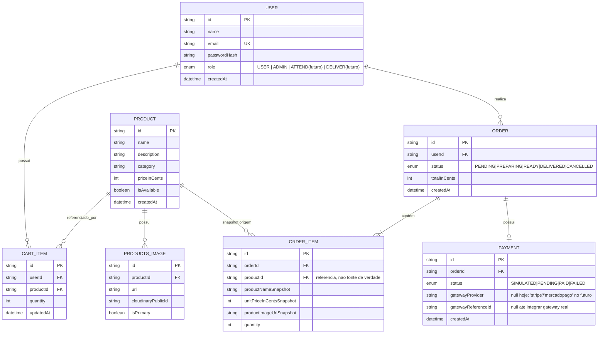
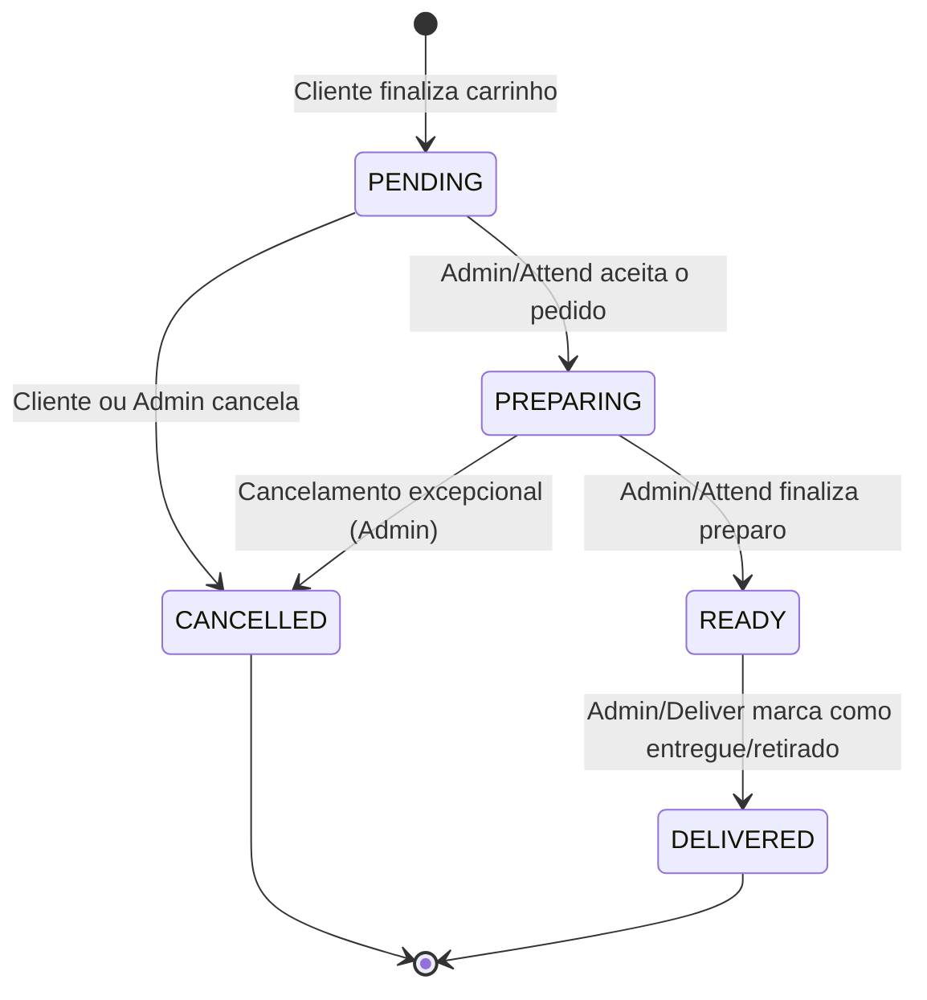
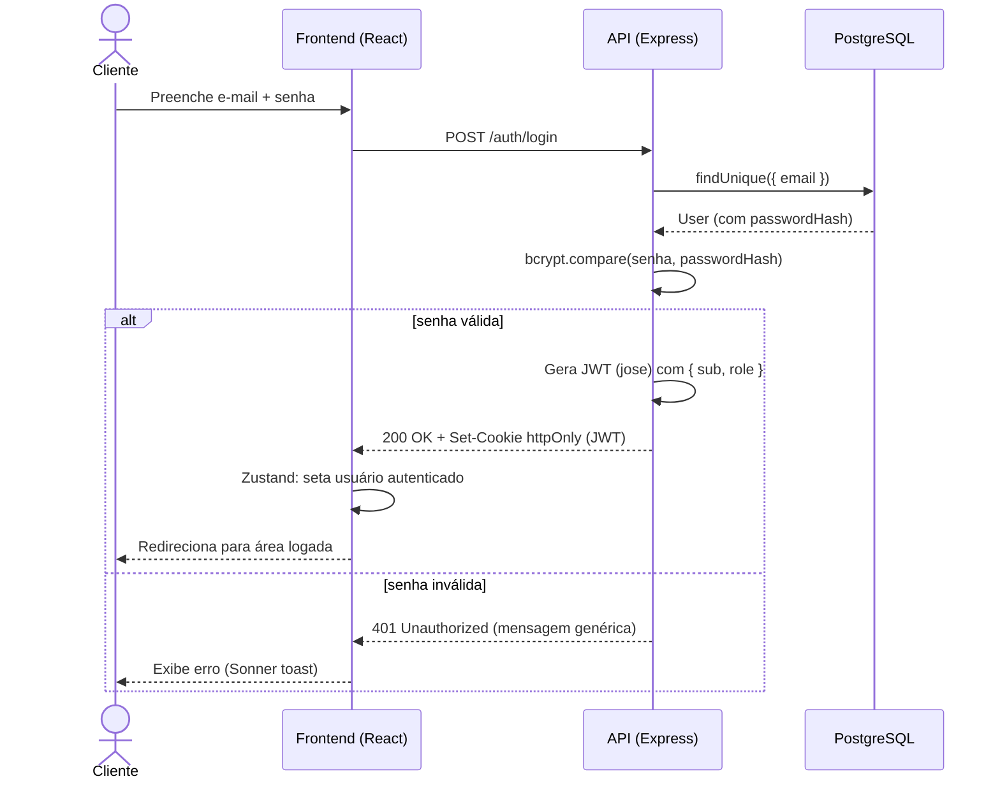
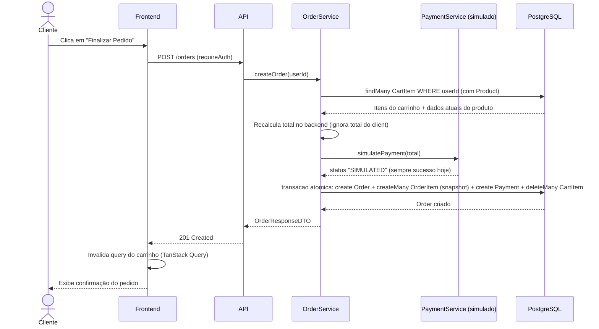
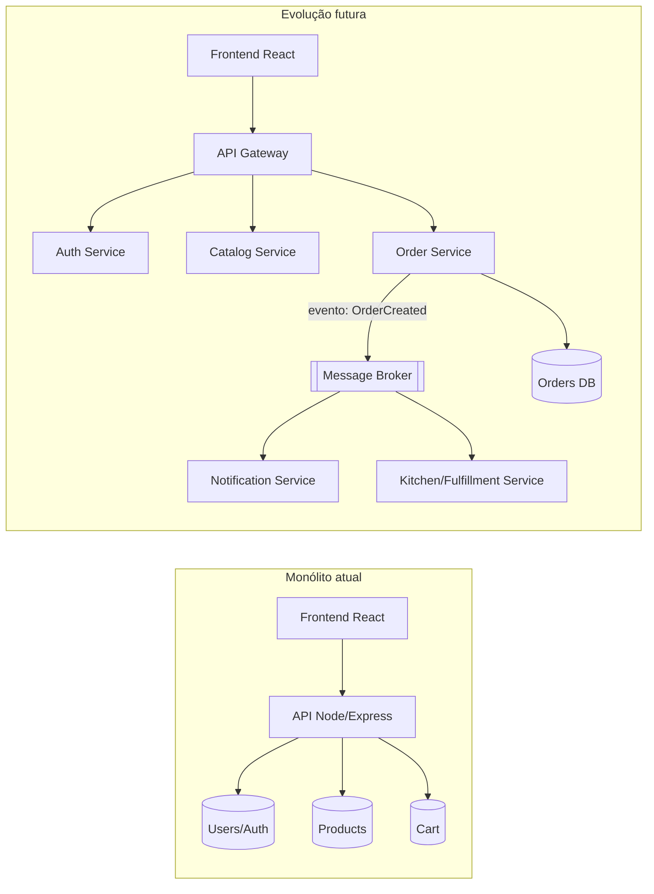

# 📄 Documento de Regras de Negócio — Casa do Hambúrguer

> **Tipo de documento:** Especificação de Requisitos + Regras de Negócio (BRD/SRS)
> **Projeto:** Casa do Hambúrguer — Sistema de Pedidos para Hamburgueria (E-commerce de Food Service)
> **Natureza:** Boilerplate reutilizável para aplicações de e-commerce/pedidos
> **Versão:** 1.1.0
> **Status:** Documento vivo — Seção 12 (pontos em aberto da v1.0.0) resolvida e incorporada

---

## 0. Nota Metodológica

Este documento nasceu de forma **retroativa** (*reverse requirements engineering*) e passou por uma primeira rodada de validação com o mantenedor do projeto. A partir da v1.1.0, ele passa a ser tratado como **fonte única de verdade**: toda nova feature, fix ou refatoração deve referenciar um item daqui, e todo PR que muda comportamento deve atualizar este arquivo
no mesmo commit (ver Seção 15 — Governança e Gatilhos de Revisão).

Selos de status:

| Selo | Significado |
|---|---|
| 🟢 **Implementado** | Já existe no código, confirmado pelo mantenedor |
| 🟡 **Em andamento** | Parcialmente implementado ou próximo passo imediato do backlog |
| 🔵 **Proposto (MVP+)** | Sugestão de arquiteto para o boilerplate ficar completo |

---

## 📋 Changelog

| Versão | Data | Mudança |
|---|---|---|
| 1.0.0 | 19/07/2026 | Documento inicial, gerado por engenharia reversa de requisitos |
| 1.1.0 | 20/07/2026 | Seção 12 (pontos em aberto) respondida pelo mantenedor; adicionado Módulo de Pagamento (3.6/6.9); adicionadas roles futuras `ATTEND`/`DELIVER`; adicionadas Seção 14 (Estratégia de Testes) e Seção 15 (Governança e Gatilhos de Code Review) |

---

## 1. Visão Geral do Produto

### 1.1 Elevator Pitch

> "Casa do Hambúrguer é uma plataforma web de pedidos para uma hamburgueria, onde clientes
> navegam pelo cardápio, montam um carrinho, finalizam pedidos e acompanham seu status 
> enquanto administradores gerenciam o catálogo de produtos e o fluxo operacional dos pedidos."

### 1.2 Objetivo de Negócio

Servir como **boilerplate mestre** para qualquer aplicação futura no modelo *catálogo → carrinho → pedido → acompanhamento*, com autenticação robusta, RBAC e arquitetura em camadas replicável
(ex.: farmácia, pet shop, marketplace de serviços). Escopo confirmado: **loja única** — sem suporte a multi-tenancy (ver RN-TENANT-01, Seção 6.10).

### 1.3 Stack Tecnológica 🟢

| Camada | Tecnologias |
|---|---|
| **Frontend** | React, TypeScript, Vite, Tailwind CSS v4, Zustand, TanStack Query, React Hook Form, Zod, Axios, Sonner |
| **Backend** | Node.js, Express, Bun (runtime/tooling), Prisma ORM, Zod, JWT (`jose`), bcrypt |
| **Banco de Dados** | PostgreSQL (hospedado na Neon) |
| **Armazenamento de mídia** | Cloudinary (upload + transformação de imagens) |
| **Infraestrutura** | Vercel (frontend), Railway (backend), Neon (database) |
| **Versionamento** | Git / GitHub — fluxo `feature/* → develop → main` com proteção de branch |

### 1.4 Identidade Visual 🟢

| Token | Cor | Uso |
|---|---|---|
| `--color-bg` | `#161410` | Fundo (tema escuro) |
| `--color-primary` | `#C41E00` | Ação primária / destaque (vermelho hambúrguer) |
| `--color-accent` | `#F2DAAC` | Texto/detalhes (tom pão brioche) |

---

## 2. Stakeholders e Personas

| Persona | Papel | Objetivo Principal | Status |
|---|---|---|---|
| **Cliente (Guest)** | Visitante não autenticado | Navegar pelo cardápio, decidir se cria conta | 🟢 |
| **Cliente (Customer)** | Usuário autenticado, role `USER` | Montar carrinho, finalizar pedido, acompanhar status | 🟢 |
| **Administrador** | Usuário autenticado, role `ADMIN` | Gerenciar produtos, visualizar/gerenciar todos os pedidos | 🟢 |
| **Atendente** | Usuário autenticado, role `ATTEND` (futura) | Operar o fluxo de pedidos no balcão/cozinha (aceitar, preparar, marcar pronto) sem acesso à gestão de catálogo | 🔵 |
| **Entregador** | Usuário autenticado, role `DELIVER` (futura) | Visualizar pedidos com status `READY` atribuídos a si e marcar como `DELIVERED` | 🔵 |
| **Desenvolvedor** | Mantenedor do boilerplate | Reaproveitar a base em projetos futuros | 🟢 |

> ✅ **Confirmado (Seção 12, pergunta 1):** hoje existem apenas `USER` e `ADMIN`.
> `ATTEND` e `DELIVER` estão no roadmap. Ver a Seção 6.3 para a proposta de permissões granulares dessas duas roles futuras.

---

## 3. Requisitos Funcionais (RF)

### 3.1 Módulo de Autenticação e Conta

| ID | Requisito | Status |
|---|---|---|
| RF-01 | O sistema deve permitir cadastro de novo usuário com nome, e-mail e senha | 🟢 |
| RF-02 | A senha deve ser armazenada apenas como hash (bcrypt), nunca em texto puro | 🟢 |
| RF-03 | O sistema deve permitir login via e-mail e senha | 🟢 |
| RF-04 | Após login, o sistema deve emitir um JWT assinado (via `jose`) e persistir em cookie `httpOnly` | 🟢 |
| RF-05 | O sistema deve restaurar a sessão do usuário ao recarregar a página (bootstrap de sessão) | 🟢 |
| RF-06 | O sistema deve permitir logout, invalidando o cookie de sessão | 🟢 |
| RF-07 | O sistema deve impedir cadastro com e-mail já existente | 🟢 |
| RF-08 | O sistema deve validar formato de e-mail e força mínima de senha no cadastro | 🟢 |
| RF-09 | O sistema deve permitir recuperação de senha via e-mail (fluxo "esqueci minha senha") | 🔵 |
| RF-10 | O sistema deve permitir edição de dados de perfil (nome, e-mail, avatar) | 🔵 |
| RF-11 | O sistema deve suportar renovação de token via refresh token (rotação de sessão) | 🔵 |
| RF-12 | O sistema deve registrar tentativas de login falhas para fins de rate limiting sem persistência auditável | 🟡 |

### 3.2 Módulo de Catálogo de Produtos

| ID | Requisito | Status |
|---|---|---|
| RF-13 | O sistema deve listar produtos disponíveis publicamente (sem autenticação) | 🟢 |
| RF-14 | Apenas administradores podem criar produtos (`POST /products`, rota protegida) | 🟢 |
| RF-15 | Um produto pode ter múltiplas imagens, armazenadas em tabela relacional `ProductsImage` | 🟢 |
| RF-16 | Upload de imagem deve validar o tipo real do arquivo por *magic bytes*, não apenas extensão/MIME declarado | 🟢 |
| RF-17 | Imagens devem ser enviadas via streaming (`Readable.from(buffer).pipe(uploadStream)`) para o Cloudinary, sem salvar em disco local | 🟢 |
| RF-18 | Variações de tamanho de imagem (thumbnail, card, detail) devem ser geradas via parâmetros de transformação de URL do Cloudinary, não por múltiplos uploads físicos | 🟢 |
| RF-19 | Administradores devem poder editar e excluir produtos (soft delete recomendado) | 🟡 |
| RF-20 | O sistema deve suportar categorização de produtos (atributo `category` na tabela `Product`) | 🟢 |
| RF-21 | O sistema deve suportar produtos com estoque/disponibilidade controlada (flag `isAvailable`) | 🟡 |
| RF-22 | O sistema deve suportar produtos configuráveis (ex.: ponto da carne, adicionais) | 🔵 |

> ✅ **Confirmado (Seção 12, pergunta 6):** a categoria já existe como atributo direto na tabela `Product` — não é uma tabela relacional separada. RF-20 e o ERD (Seção 7) foram corrigidos para refletir isso.

### 3.3 Módulo de Carrinho

| ID | Requisito | Status |
|---|---|---|
| RF-23 | Usuário autenticado pode adicionar produto ao carrinho | 🟢 |
| RF-24 | Usuário pode atualizar a quantidade de um item via `PATCH /cart-item/:cartItemId` | 🟢 |
| RF-25 | Adicionar um produto já existente no carrinho deve incrementar a quantidade (não duplicar linha) via upsert de chave composta `userId_productId` | 🟢 |
| RF-26 | Alterações no carrinho devem refletir na UI de forma otimista, com rollback em caso de falha | 🟢 |
| RF-27 | Apenas o dono do carrinho pode alterar seus próprios itens (nunca `requiredAdmin` em rota de carrinho de usuário) | 🟢 |
| RF-28 | Usuário deve poder remover item do carrinho | 🟢 |
| RF-29 | Usuário deve poder esvaziar o carrinho por completo | 🟢 |
| RF-30 | O sistema deve recalcular o total do carrinho no backend (nunca confiar no total enviado pelo frontend) | 🟢 |
| RF-31 | Carrinho deve expirar/limpar após finalização bem-sucedida do pedido | 🔵 |

### 3.4 Módulo de Pedidos (Orders)

| ID | Requisito | Status |
|---|---|---|
| RF-32 | O sistema deve permitir converter um carrinho em um pedido (`Order`) | 🔵 |
| RF-33 | Cada item do pedido (`OrderItem`) deve gravar uma **cópia (snapshot)** dos dados do produto no momento da compra (nome, preço, imagem) — *Snapshot Pattern* | 🔵 |
| RF-34 | Pedidos devem ter um campo de status: `PENDING`, `PREPARING`, `READY`, `DELIVERED`, `CANCELLED` | 🔵 |
| RF-35 | Administradores devem poder visualizar todos os pedidos e alterar seu status | 🔵 |
| RF-36 | Usuário deve poder visualizar apenas o histórico de seus próprios pedidos | 🔵 |
| RF-37 | Preço deve ser tratado como inteiro (centavos) para evitar erros de ponto flutuante | 🟢 |
| RF-38 | Deve haver validação de transição de status (máquina de estados — ver Seção 8) | 🔵 |
| RF-39 | Sistema deve notificar o cliente (e-mail/push/websocket) em mudanças de status do pedido | 🔵 |
| RF-40 | Sistema deve suportar cancelamento de pedido pelo cliente, respeitando janela de tempo/status | 🔵 |

> ✅ **Confirmado (Seção 12, pergunta 3):** os cinco status permanecem exatamente `PENDING/PREPARING/READY/DELIVERED/CANCELLED`,
> `ATTEND`/`DELIVER` roles futuras. 
> A proposta de mapeamento role↔status está na Seção 6.3 (RN-RBAC-08).

### 3.5 Módulo Administrativo

| ID | Requisito | Status |
|---|---|---|
| RF-41 | Rotas administrativas devem ser protegidas por middleware `requiredAdmin` | 🟢 |
| RF-42 | Painel administrativo deve permitir CRUD completo de produtos | 🟢 |
| RF-43 | Painel administrativo deve permitir gestão de pedidos (Kanban de status) | 🟢 |
| RF-44 | Painel administrativo deve exibir métricas básicas (pedidos do dia, faturamento) | 🔵 |
| RF-45 | Deve existir auditoria (log) de ações administrativas sensíveis | 🔵 |

### 3.6 Módulo de Pagamento 🆕

> Módulo novo nesta versão — não existia na v1.0.0. Nasce das respostas à perguntas 2 da Seção 12 original.

| ID | Requisito | Status |
|---|---|---|
| RF-46 | O sistema deve simular a etapa de pagamento no fluxo de checkout, sem processar transação financeira real | 🔵 |
| RF-47 | O sistema deve integrar um gateway de pagamento real (ex.: Stripe) para processar cobranças de verdade | 🔵 |
| RF-48 | O sistema **nunca** deve armazenar dados sensíveis de cartão (PAN, CVV) no próprio banco — toda tokenização deve ocorrer no gateway (escopo PCI-DSS minimizado) | 🔵 |
| RF-49 | O sistema deve registrar o resultado do pagamento (`PAID`, `FAILED`, `PENDING`) vinculado ao `Order`, independente do gateway usado | 🔵 |
| RF-50 | O sistema deve tratar webhooks do gateway de pagamento para confirmar pagamento de forma assíncrona (não apenas resposta síncrona do checkout) | 🔵 |

---

## 4. Requisitos Não Funcionais (RNF)

| ID | Categoria | Requisito | Status |
|---|---|---|---|
| RNF-01 | Segurança | Senhas devem usar bcrypt com salt rounds ≥ 10 | 🟢 |
| RNF-02 | Segurança | Sessão via JWT em cookie `httpOnly`, `secure`, `sameSite` correto por ambiente | 🟢 |
| RNF-03 | Segurança | Uploads devem ser validados por assinatura binária (magic bytes), não apenas extensão | 🟢 |
| RNF-04 | Segurança | Toda entrada de API deve ser validada via schema (Zod) antes de tocar a camada de serviço | 🟢 |
| RNF-05 | Segurança | Rotas administrativas nunca devem vazar para operações de usuário comum (e vice-versa) | 🟢 |
| RNF-06 | Segurança | Rate limiting em rotas de autenticação | 🟡 |
| RNF-07 | Segurança | Proteção CSRF para rotas mutáveis expostas a cookies | 🔵 |
| RNF-08 | Segurança | Cabeçalhos de segurança HTTP (Helmet: CSP, HSTS, X-Frame-Options) | 🔵 |
| RNF-09 | Performance | Imagens devem ser servidas em tamanho adequado ao contexto via transformação de URL (CDN) | 🟢 |
| RNF-10 | Performance | Estado de servidor deve ter única fonte de verdade (TanStack Query), evitando cache duplicado | 🟢 |
| RNF-11 | Performance | Consultas frequentes devem ter índices no banco (ex.: `productId`, `userId`, `status`) | 🔵 |
| RNF-12 | Performance | Core Web Vitals (LCP, CLS, INP) dentro da faixa "Good" do Lighthouse | 🔵 |
| RNF-13 | Confiabilidade | Migrations de banco devem ser versionadas (`prisma migrate dev`), nunca `db push` em produção | 🟢 |
| RNF-14 | Confiabilidade | Operações que envolvem múltiplas tabelas (ex.: criar pedido + baixar carrinho) devem usar transação Prisma (`$transaction`) | 🟢 |
| RNF-15 | Manutenibilidade | Separação em camadas: `routes → controllers → services → repositories` | 🟢 |
| RNF-16 | Manutenibilidade | Nenhuma regra de negócio dentro de controller — controller apenas orquestra | 🟢 |
| RNF-17 | Escalabilidade | Domínio de Pedidos deve ser isolável em serviço próprio no futuro (ver Seção 10) | 🔵 |
| RNF-18 | Usabilidade | Feedback visual imediato (otimista) em ações do carrinho | 🟢 |
| RNF-19 | Observabilidade | Logs estruturados de erros de API (nível mínimo: método, rota, status, tempo) | 🔵 |
| RNF-20 | Testabilidade | Cobertura de testes automatizados para regras de negócio críticas (carrinho, pedido, autenticação) — ver Seção 14 | 🔵 |
| RNF-21 | Portabilidade | Nenhuma URL hardcoded — todo endpoint via variável de ambiente | 🟢 |
| RNF-22 | Multi-tenancy | Sistema é single-tenant por design — não há isolamento de dados por loja | 🟢 |

---

## 5. Histórias de Usuário (User Stories)

Formato: `Como <persona>, eu quero <ação>, para que <benefício>` + Critérios de Aceite (Gherkin).

### US-01 — Cadastro de conta 🟢
**Como** visitante, **eu quero** criar uma conta com e-mail e senha, com no mínimo 9 caracteres **para que** eu possa fazer pedidos.

```gherkin
Dado que estou na tela de cadastro
Quando informo nome, e-mail válido e senha com no mínimo 9 caracteres
e confirmo o cadastro. Então, minha conta é criada com a senha armazenada como hash, e sou automaticamente autenticado
```

### US-02 — Login 🟢
**Como** cliente cadastrado, **eu quero** logar com e-mail e senha, **para que** eu acesse minha conta.

```gherkin
Dado que possuo uma conta ativa, quando informo credenciais corretas, então recebo um cookie httpOnly de sessão e sou redirecionado para a área autenticada
Quando informo credenciais incorretas, então recebo uma mensagem genérica de erro (sem indicar se o e-mail existe)
```

> 🔒 Nota de segurança: a mensagem de erro de login **não deve diferenciar** "e-mail não encontrado" de "senha incorreta" — isso evita enumeração de usuários (OWASP A07).

### US-03 — Adicionar produto ao carrinho 🟢
**Como** cliente autenticado, **eu quero** adicionar um hambúrguer ao carrinho, **para que** eu possa comprá-lo depois.

```gherkin
Dado que estou autenticado e visualizando um produto disponível. 
Quando clico em "Adicionar ao carrinho", 
então o item aparece no carrinho com quantidade 1

Quando adiciono o mesmo produto novamente
Então a quantidade do item existente é incrementada, sem duplicar a linha
```

### US-04 — Atualizar quantidade no carrinho 🟢
**Como** cliente, **eu quero** alterar a quantidade de um item no carrinho, **para que** eu possa ajustar meu pedido antes de finalizar.

```gherkin
Dado que tenho um item no carrinho
Quando altero a quantidade para um novo valor válido (> 0)
Então a UI atualiza imediatamente (otimista)
E o backend confirma a alteração via PATCH /cart-item/:cartItemId

Quando a requisição falha
Então a UI reverte para o valor anterior (rollback)
E uma notificação de erro é exibida
```

### US-05 — Finalizar pedido 🔵
**Como** cliente, **eu quero** finalizar meu carrinho como um pedido, **para que** a hamburgueria comece a prepará-lo.

```gherkin
Dado que meu carrinho possui ao menos 1 item
Quando confirmo o pedido
Então um registro Order é criado com status inicial "PENDING"
E cada item do carrinho vira um OrderItem com snapshot do produto (nome, preço, imagem)
E o carrinho é esvaziado
E o total é recalculado no backend, ignorando qualquer total enviado pelo cliente
E a etapa de pagamento é simulada (RF-46), sem cobrança real
```

### US-06 — Administrador cadastra produto 🟢
**Como** administrador, **eu quero** cadastrar um novo produto com imagem, **para que** ele apareça no cardápio.

```gherkin
Dado que estou autenticado como ADMIN
Quando envio nome, descrição, categoria, preço e uma imagem válida
Então o arquivo é validado por magic bytes (não apenas extensão)
E a imagem é enviada via stream para o Cloudinary
E o produto passa a ser listado publicamente

Quando um usuário não-ADMIN tenta a mesma ação
Então a API retorna 403 Forbidden
```

### US-07 — Administrador gerencia status de pedidos 🔵
**Como** administrador, **eu quero** alterar o status de um pedido, **para que** o cliente saiba o andamento.

```gherkin
Dado que existe um pedido com status "PENDING"
Quando altero o status para "PREPARING"
Então a transição é validada contra a máquina de estados permitida
E a alteração é refletida na listagem em tempo real (revalidação de query)
```

### US-08 — Cliente acompanha pedido 🔵
**Como** cliente, **eu quero** ver o status atual do meu pedido, **para que** eu saiba quando retirar/receber.

```gherkin
Dado que fiz um pedido
Quando acesso "Meus Pedidos"
Então vejo apenas pedidos vinculados ao meu userId
E vejo o status atual e o histórico de itens (snapshot no momento da compra)
```

### US-09 — Atendente avança o pedido na cozinha 🔵 *(role futura `ATTEND`)*
Como atendente, quero marcar um pedido como "em preparo" e, depois, "pronto", para que o fluxo da cozinha fique visível para todos.

```gherkin
Dado que estou autenticado com role ATTEND
E existe um pedido com status "PENDING"
Quando marco o pedido como "PREPARING"
Então o status é atualizado e visível ao cliente
E eu NÃO tenho acesso às rotas de gestão de catálogo (criar/editar/excluir produto)
```

### US-10 — Entregador finaliza a entrega 🔵 *(role futura `DELIVER`)*
**Como** entregador, **eu quero** ver os pedidos com status "READY", **para que** eu saiba o que retirar para entrega.

```gherkin
Dado que estou autenticado com role DELIVER
Quando acesso a lista de pedidos
Então vejo apenas pedidos com status "READY" ou "DELIVERED" atribuídos a mim
E posso alterar um pedido de "READY" para "DELIVERED"
E NÃO posso alterar para nenhum outro status
```

---

## 6. Regras de Negócio Detalhadas

### 6.1 Autenticação, Cookies e Tokenização 🟢 / 🔵

| Regra | Descrição |
|---|---|
| RN-AUTH-01 🟢 | Senha nunca trafega nem é armazenada em texto puro — hash bcrypt (custo ≥ 10) antes de qualquer persistência |
| RN-AUTH-02 🟢 | Sessão é representada por JWT assinado com `jose`, contendo `sub` (userId) e `role`, com expiração curta (ex.: 15min–1h) |
| RN-AUTH-03 🟢 | O JWT é entregue exclusivamente via cookie `httpOnly` + `secure` (produção) — nunca em `localStorage`/`sessionStorage`, para mitigar roubo via XSS |
| RN-AUTH-04 🔵 | `sameSite` deve ser `lax` em same-site e `none` (+ `secure: true`) quando frontend e backend estão em domínios diferentes (Vercel × Railway) |
| RN-AUTH-05 🔵 | Deve existir um **refresh token** de vida longa, também `httpOnly`, para renovar o access token sem exigir novo login — rotação de token a cada uso (evita replay) |
| RN-AUTH-06 🟢 | Logout invalida o cookie no cliente; se o refresh token existir, deve haver blacklist/revogação no servidor |
| RN-AUTH-07 🟢 | Toda rota protegida passa pelo middleware `requireAuth`, que decodifica e valida o JWT antes de liberar acesso ao `req.user` |

### 6.2 Criptografia de Senhas 🟢

| Regra | Descrição |
|---|---|
| RN-CRYPT-01 🟢 | Algoritmo: `bcrypt`, fator de custo mínimo 10 (idealmente 12 em produção) |
| RN-CRYPT-02 🟢 | Comparação de senha usa `bcrypt.compare`, nunca comparação manual de hash |
| RN-CRYPT-03 🟢 | Senha nunca é incluída em nenhum payload de resposta da API (ver DTOs, Seção 6.5) |
| RN-CRYPT-04 🟢 | Política de senha mínima: 9+ caracteres, ao menos 1 número, ao menos 1 caractere especial e ao menos uma letra maiúscula — validada via Zod tanto no client quanto no server |

### 6.3 Gerenciamento de Roles (RBAC) 🟢 (atual) + 🔵 (futuro)

| Regra | Descrição | Status |
|---|---|---|
| RN-RBAC-01 | Papéis suportados hoje: `USER` (padrão) e `ADMIN` | 🟢 |
| RN-RBAC-02 | Role é definida no banco (`User.role`) e embutida no payload do JWT no login | 🟢 |
| RN-RBAC-03 | Middleware `requiredAdmin` verifica `req.user.role === 'ADMIN'`; qualquer outra role recebe `403 Forbidden` | 🟢 |
| RN-RBAC-04 | Middleware de admin **nunca** deve ser aplicado a rotas de recurso pessoal do usuário (ex.: seu próprio carrinho) | 🟢 |
| RN-RBAC-05 | Autorização é sempre validada no backend — checagens de role no frontend são apenas cosméticas (UX), nunca a fonte de verdade de segurança | 🟢 |
| RN-RBAC-06 | Hoje `USER` cobre: visualizar produtos, adicionar/remover/editar itens do carrinho, realizar compras. `ADMIN` cobre tudo isso + criar produtos, editar/excluir produtos (edição/exclusão ainda 🟡), e acompanhar todos os pedidos | 🟡 |
| RN-RBAC-07 | **[Proposto]** Role `ATTEND`: acesso de leitura/escrita apenas ao módulo de Pedidos (transições de status `PENDING→PREPARING→READY`); **sem** acesso a CRUD de produtos nem a dados de outros usuários além do necessário para o pedido | 🔵 |
| RN-RBAC-08 | **[Proposto]** Role `DELIVER`: acesso de leitura restrito a pedidos com status `READY`/`DELIVERED`; única transição permitida é `READY → DELIVERED`; sem acesso a `PENDING`/`PREPARING` nem ao catálogo | 🔵 |
| RN-RBAC-09 | **[Proposto]** Migrar de checagem de role única (`role === 'ADMIN'`) para checagem baseada em array de permissões (ex.: `hasPermission(user, 'orders:transition:preparing')`) quando a 3ª/4ª role for introduzida — evita `if/else` explosivo no middleware | 🔵 |

> ⚠️ **Nota:** implementar `ATTEND`/`DELIVER` com checagem única de string
> (`role === 'ADMIN'`) como hoje vai funcionar até a 2ª role nova — a partir da 3ª role, o código de autorização vira uma árvore de `if` difícil de manter.
> Recomendado RN-RBAC-09 (permissões, não só papéis) quando for implementar a primeira das duas roles novas — é bem mais barato migrar agora do que depois de já ter 4 papéis espalhados em rotas.

### 6.4 Arquitetura MVC Adaptada 🟢

```
Requisição HTTP
      │
      ▼
┌─────────────┐   valida payload de entrada (Zod)
│   Routes    │───────────────────────────────────┐
└─────────────┘                                    │
      │ delega                                     ▼
      ▼                                     ┌──────────────┐
┌─────────────┐   orquestra fluxo,          │  Middlewares  │
│ Controllers │◄─────────────────────────── │ requireAuth   │
└─────────────┘   sem regra de negócio      │ requiredAdmin │
      │ chama                               │ validateBody  │
      ▼                                     └──────────────┘
┌─────────────┐   regra de negócio pura,
│  Services   │   orquestra repositórios,
└─────────────┘   aplica DTOs/serialização
      │ chama
      ▼
┌─────────────┐   única camada que fala
│Repositories │   com o Prisma Client
└─────────────┘
      │
      ▼
┌─────────────┐
│  PostgreSQL │
└─────────────┘
```

| Camada | Responsabilidade | Não deve fazer |
|---|---|---|
| **Routes** | Mapear método+path → controller, aplicar middlewares | Lógica de negócio |
| **Controllers** | Ler `req`, chamar service, formatar `res` | Acessar Prisma diretamente |
| **Services** | Regras de negócio, transações, orquestração entre repositórios | Conhecer `req`/`res` do Express |
| **Repositories** | Única camada com `prisma.<model>` | Regra de negócio |
| **DTOs/Mappers** | Formatar saída (esconder campos sensíveis) | Validação de entrada (isso é papel do Zod na entrada) |

### 6.5 DTO e Serialização de Dados 🟢 / 🟡 / 🔵

| Regra | Descrição |
|---|---|
| RN-DTO-01 🔵 | Toda resposta de API que envolve `User` deve passar por um mapper que remove `password` (hash) do payload — nunca confiar no Prisma `select` implícito |
| RN-DTO-02 🟢 | Entrada de dados (`request body`) é validada com **schemas Zod dedicados por rota** (ex.: `createUserSchema`, `createOrderSchema`), nunca reaproveitando o schema do banco |
| RN-DTO-03 🟡 | Saída de dados usa **DTOs explícitos** (ex.: `UserResponseDTO`, `ProductResponseDTO`, `OrderResponseDTO`) — desacopla o formato de API do schema interno do Prisma |
| RN-DTO-04 🟢 | Preços são serializados como inteiros em centavos no backend e formatados (R$) somente na camada de apresentação (frontend) |
| RN-DTO-05 🔵 | Datas trafegam em ISO 8601 (UTC); formatação de fuso/local é responsabilidade do frontend |

**Exemplo de contrato:**

```ts
// Schema de validação de ENTRADA (Zod)
const createUserSchema = z.object({
  name: z.string().min(2),
  email: z.string().email(),
  password: z.string().min(8),
});

// DTO de SAÍDA (nunca inclui password/hash)
type UserResponseDTO = {
  id: string;
  name: string;
  email: string;
  role: 'USER' | 'ADMIN' | 'ATTEND' | 'DELIVER'; // ATTEND/DELIVER quando implementadas
  createdAt: string; // ISO 8601
};
```

### 6.6 Persistência de Dados 🟢 / 🔵

| Regra | Descrição |
|---|---|
| RN-DATA-01 🟢 | ORM: Prisma sobre PostgreSQL (Neon) |
| RN-DATA-02 🟢 | Alterações de schema **sempre** via `prisma migrate dev` (nunca `db push` fora do ambiente local de prototipagem) — garante histórico auditável de migrations |
| RN-DATA-03 🟢 | Chaves compostas únicas para evitar duplicidade lógica (ex.: `@@unique([userId, productId])` em `CartItem`) |
| RN-DATA-04 🔵| Operações que afetam múltiplas tabelas de forma atômica (ex.: finalizar pedido = criar Order + OrderItems + esvaziar Cart) devem usar `prisma.$transaction([...])` |
| RN-DATA-05 🔵 | Soft delete (`deletedAt: DateTime?`) para entidades com histórico relevante (Product, User) em vez de `DELETE` físico |

### 6.7 Carrinho de Compras 🟢

| Regra | Descrição |
|---|---|
| RN-CART-01 🟢 | Cada usuário possui um único carrinho ativo (implícito ou explícito via `Cart` 1:1 com `User`) |
| RN-CART-02 🟢 | Adicionar produto já presente no carrinho **incrementa** a quantidade via upsert com chave `(userId, productId)` — nunca cria linha duplicada |
| RN-CART-03 🟢 | Quantidade mínima por item é 1; ao reduzir para 0, o item deve ser removido do carrinho |
| RN-CART-04 🟢 | Toda mutação de carrinho é otimista na UI, com rollback automático em erro de rede/servidor |
| RN-CART-05 🟢 | Rotas de carrinho autenticam por `requireAuth`, **nunca** por `requiredAdmin` — o recurso pertence ao próprio usuário |
| RN-CART-06 🟢 | O total do carrinho exibido no frontend é apenas informativo — o valor cobrado é sempre recalculado no backend no momento da criação do pedido |

### 6.8 Pedidos (Orders) — Snapshot Pattern 🔵

| Regra | Descrição |
|---|---|
| RN-ORDER-01 🔵 | Ao criar um pedido, cada `CartItem` gera um `OrderItem` com **cópia imutável** dos dados do produto (nome, preço unitário, URL de imagem) no momento da compra |
| RN-ORDER-02 🔵 | Justificativa do Snapshot Pattern: se o preço ou nome do produto mudar no catálogo depois, o histórico do pedido **não pode ser afetado retroativamente** — nota fiscal/histórico é imutável |
| RN-ORDER-03 🔵 | `Order` referencia `productId` apenas para rastreabilidade (ex.: link "ver produto"), mas os dados exibidos no pedido vêm do snapshot, nunca de um `JOIN` ao vivo com `Product` |
| RN-ORDER-04 🔵 | Preço é armazenado como inteiro em centavos em todo o fluxo (evita erro de ponto flutuante em somas) |
| RN-ORDER-05 🔵 | Status do pedido segue máquina de estados finita (ver Seção 8) — transições inválidas são rejeitadas no service layer |
| RN-ORDER-06 🔵 | Um usuário só pode visualizar/cancelar os próprios pedidos (`Order.userId === req.user.id`), exceto administradores |
| RN-ORDER-07 🔵 | Quando `ATTEND`/`DELIVER` existirem, a transição de status deve checar não só o papel (role), mas se o papel tem permissão para **aquela transição específica** (ver RN-RBAC-07/08) |

### 6.9 Pagamento (Simulado hoje, Gateway real no futuro) 🆕

| Regra | Descrição | Status |
|---|---|---|
| RN-PAY-01 | Hoje, "pagamento" é um passo simulado do checkout — nenhuma cobrança real ocorre, nenhum dado de cartão é coletado | 🟢 |
| RN-PAY-02 | O campo `Order.paymentStatus` (ou entidade `Payment` dedicada) deve existir independentemente do gateway, para já preparar o modelo de dados para a integração futura | 🔵 |
| RN-PAY-03 | Quando um gateway real for integrado, o backend **nunca** deve tocar em dados brutos de cartão — apenas em tokens/IDs devolvidos pelo gateway (Stripe Elements, Checkout hospedado, etc.) | 🔵 |
| RN-PAY-04 | Confirmação de pagamento definitiva deve vir de **webhook assíncrono** do gateway, não apenas da resposta imediata do checkout (evita fraude de "response spoofing" no client) | 🔵 |
| RN-PAY-05 | Ambiente de desenvolvimento/portfólio deve usar exclusivamente o **modo de teste (sandbox)** do gateway escolhido — nunca chaves de produção em `.env` de exemplo ou repositório público | 🟢 |


### 6.10 Escopo e Multi-tenancy

| Regra | Descrição | Status |
|---|---|---|
| RN-TENANT-01 | O sistema é **single-tenant**: representa uma única hamburgueria por deploy. Não há coluna `storeId`/`tenantId` em nenhuma tabela, nem isolamento de dados por loja | 🟢 |
| RN-TENANT-02 | Caso um projeto futuro derivado deste boilerplate precise de multi-tenancy, a estratégia recomendada é **schema-per-tenant** ou coluna `tenantId` + Row-Level Security no Postgres | 🔵 |

---

## 7. Modelagem de Dados (ERD)



> 🔒 Notas do ERD:
> - `category` agora é um **atributo direto** de `PRODUCT` (confirmado, Seção 12), não mais uma FK "futura".
> - `PAYMENT` é a entidade nova do Módulo de Pagamento (Seção 3.6/6.9) — hoje só o status `SIMULATED` é usado na prática.
> - `ORDER_ITEM` **não** tem foreign key "viva" para os campos exibidos — são colunas de snapshot, mesmo mantendo `productId` como referência de rastreabilidade.
> - `CART_ITEM` mantém a constraint `@@unique([userId, productId])` (RN-CART-02).

---

## 8. Máquina de Estados — Ciclo de Vida do Pedido 🔵



**Regra de transição (RN-ORDER-05):** qualquer tentativa de mudar o status fora das setas acima (ex.: `DELIVERED → PENDING`) deve ser rejeitada na camada de **service**, retornando `422 Unprocessable Entity`, mesmo que a requisição HTTP em si seja válida.

**Mapeamento role → transição permitida (proposta, RN-RBAC-07/08):**

| Transição | `ADMIN` | `ATTEND` (futuro) | `DELIVER` (futuro) |
|---|---|---|---|
| `PENDING → PREPARING` | ✅ | ✅ | ❌ |
| `PREPARING → READY` | ✅ | ✅ | ❌ |
| `READY → DELIVERED` | ✅ | ❌ | ✅ |
| `* → CANCELLED` | ✅ | ❌ | ❌ |

---

## 9. Fluxos Sequenciais (Diagramas de Sequência)

### 9.1 Fluxo de Login



### 9.2 Fluxo de Finalização de Pedido (Checkout)



---

## 10. MVP e Roadmap Evolutivo

### 10.1 Definição de MVP (o mínimo para o boilerplate ser reutilizável)

| Módulo | Escopo mínimo do MVP |
|---|---|
| Auth | Cadastro, login, logout, JWT em cookie httpOnly, RBAC (USER/ADMIN) |
| Catálogo | CRUD de produto (admin), categorias, listagem pública, upload de imagem seguro |
| Carrinho | Adicionar/atualizar/remover item, upsert por chave composta |
| Pedido | Criar pedido a partir do carrinho com snapshot, listar por usuário, admin altera status |
| Pagamento | Simulação de checkout (sem gateway real obrigatório para o MVP) |
| Infra | CI/CD funcional (Vercel + Railway + Neon), migrations versionadas |

> 🟢 O MVP será fechado quando as lacunas mais importantes estiverem  **finalizadas:a criação de pedido de ponta a ponta (RF-32/33/34/35, hoje 🟡)** e **validar a máquina de estados no service (RF-38)**.

### 10.2 Roadmap Pós-MVP

| Fase | Entregas | Prioridade sugerida |
|---|---|---|
| **Fase 2 — Fechar o MVP** | Finalizar fluxo de criação de pedido, máquina de estados validada no service | **Alta — próxima sprint** |
| **Fase 3 — Robustez** | Refresh token + rotação, rate limiting, Helmet, testes automatizados (ver Seção 14) | Alta |
| **Fase 4 — Experiência** | Notificações de status, histórico de pedidos, recuperação de senha | Média |
| **Fase 5 — Operação** | Roles `ATTEND`/`DELIVER`, painel de métricas admin, soft delete, auditoria | Média |
| **Fase 6 — Pagamento real** | Integração Stripe/Mercado Pago em modo live, webhooks | Média |
| **Fase 7 — Escala** | Extração do domínio de Pedidos para microsserviço dedicado (ver 10.3) | Baixa (só se necessário) |

### 10.3 Visão de Microsserviço de Pedidos (futuro) 🔵

Se o volume justificar, o módulo de Pedidos pode ser extraído do monólito:



---

## 11. Segurança — Checklist OWASP Aplicado ao Projeto

| Risco OWASP Top 10 | Mitigação no projeto | Status |
|---|---|---|
| A01 — Broken Access Control | `requireAuth`/`requiredAdmin` middlewares; RN-RBAC-04 | 🟢 |
| A02 — Cryptographic Failures | bcrypt para senha; JWT assinado; cookies httpOnly/secure | 🟢 |
| A03 — Injection | Prisma (queries parametrizadas) + Zod na entrada | 🟢 |
| A04 — Insecure Design | Snapshot Pattern em pedidos; total recalculado no backend | 🔵 |
| A05 — Security Misconfiguration | Helmet, CSP, variáveis de ambiente sem hardcode | 🟢 |
| A07 — Identification/Auth Failures | Mensagens de erro genéricas no login; rate limiting | 🟡 |
| A08 — Software and Data Integrity | Magic bytes na validação de upload | 🟢 |
| A09 — Logging & Monitoring Failures | Logs estruturados de erro de API | 🔵 |
| A10 — SSRF | N/A no escopo atual (sem fetch de URLs arbitrárias do usuário) | — |

---

## 12. Registro de Decisões Confirmadas (histórico)

> Esta seção substitui a antiga "Pontos em Aberto" da v1.0.0 — todas as perguntas foram respondidas pelo mantenedor em 20/07/2026 e já incorporadas nas seções correspondentes.
> Mantida aqui como **registro histórico de decisão**, no espírito de um ADR resumido.

| # | Pergunta original | Decisão | Onde foi aplicada |
|---|---|---|---|
| 1 | Roles além de USER/ADMIN? | Hoje só USER/ADMIN. `ATTEND` e `DELIVER` no roadmap, com permissões propostas | Seção 2, 6.3, 8 |
| 2 | Gateway de pagamento pago? | Mantido simulado por ora; Stripe test mode é gratuito e é a recomendação para quando integrar de verdade | Seção 3.6, 6.9 |
| 3 | Nomes reais do status do pedido? | Confirmado `PENDING/PREPARING/READY/DELIVERED/CANCELLED`, mantidos mesmo com roles futuras | Seção 3.4, 7, 8 |
| 4 | Multi-tenant? | Não — loja única | Seção 1.2, 6.10 |
| 5 | Suíte de testes existente? | Nenhuma ainda — estratégia de 3 tipos principais definida | Seção 14 |
| 6 | Categoria de produto já existe? | Sim, atributo direto na tabela `Product` (não é tabela separada) | Seção 3.2, 7 |

---

## 13. Glossário

| Termo | Definição |
|---|---|
| **Snapshot Pattern** | Padrão onde uma entidade histórica (ex.: item de pedido) guarda uma cópia imutável dos dados de origem no momento do evento, em vez de referenciar dados que podem mudar |
| **DTO (Data Transfer Object)** | Objeto que define exatamente o formato de dados trafegado entre camadas/API, desacoplado do modelo de banco |
| **RBAC (Role-Based Access Control)** | Controle de acesso baseado em papéis (roles) atribuídos ao usuário |
| **Upsert** | Operação que atualiza um registro se ele existe, ou cria se não existe (`INSERT ... ON CONFLICT`) |
| **Otimista (UI otimista)** | Técnica de UX onde a interface assume o sucesso da operação antes da confirmação do servidor, revertendo (rollback) em caso de erro |
| **Magic Bytes** | Assinatura binária nos primeiros bytes de um arquivo que identifica seu tipo real, usada para validar uploads além do MIME type declarado |
| **httpOnly Cookie** | Cookie inacessível via JavaScript no navegador, mitigando roubo de token via XSS |
| **Sandbox / Test Mode** | Ambiente de um serviço externo (ex.: gateway de pagamento) que simula o comportamento real sem mover dinheiro/dados reais, usado para desenvolvimento e testes |
| **Webhook** | Chamada HTTP assíncrona feita por um serviço externo (ex.: gateway de pagamento) para notificar o sistema sobre um evento (ex.: pagamento confirmado) |

---

## 14. Estratégia de Testes 🆕

> Nenhum teste automatizado existe hoje (confirmado, Seção 12). Esta seção define a estratégia mínima antes de escrever o primeiro teste — pensar a pirâmide antes de codificar evita "testar tudo de qualquer jeito" depois.

### 14.1 Os 3 tipos essenciais (Pirâmide de Testes)

```
        ▲
       ╱ ╲        E2E (poucos, caros, lentos)
      ╱   ╲       → fluxos críticos completos, via navegador real
     ╱─────╲
    ╱       ╲     Integração / API (intermediário)
   ╱         ╲    → testa rotas reais contra banco de teste
  ╱───────────╲
 ╱             ╲  Unitários (muitos, baratos, rápidos)
╱───────────────╲ → regra de negócio isolada, sem I/O
```

| Tipo | Ferramenta recomendada | O que testar aqui | Prioridade |
|---|---|---|---|
| **Unitários** | Vitest | Regras de negócio puras e isoláveis: cálculo de total do carrinho (RN-CART-06), lógica de máquina de estados (RN-ORDER-05), validações de Zod, funções de mapeamento DTO | 🔴 Alta — comece aqui |
| **Integração / API** | Vitest + Supertest (+ banco de teste via Docker/Testcontainers ou schema isolado na Neon) | Rotas reais ponta a ponta no backend: `POST /auth/login`, `POST /cart-item`, `POST /orders` — valida middlewares, status HTTP, formato de resposta (DTOs) | 🔴 Alta |
| **E2E** | Playwright | Jornadas completas do usuário no navegador: cadastro→login→adicionar ao carrinho→finalizar pedido; e login admin→criar produto→ver na listagem pública | 🟡 Média — depois que unit/integração cobrirem o core |

### 14.2 Complementos opcionais (não são os 3 principais, mas vale considerar depois)

| Tipo extra | Quando vale a pena |
|---|---|
| **Mutation Testing (Stryker)** | Depois que já existir boa cobertura — mede se os testes *realmente* pegam bugs, não só se "passam" |
| **Testes de segurança automatizados** | Scanner de dependências vulneráveis (`npm audit`/Dependabot) no CI — barato de configurar, alto retorno |
| **Testes de contrato de API** | Se o frontend e backend forem mantidos por pessoas/times diferentes no futuro — garante que a API não quebra o contrato esperado pelo client |

### 14.3 Onde priorizar primeiro (dado o estado atual do projeto)

1. **RN-ORDER-05 (máquina de estados)** — unitário, é lógica pura e crítica, fácil de testar e de quebrar sem perceber
2. **RN-CART-02 (upsert sem duplicar linha)** e **RN-CART-06 (recalcular total no backend)** — integração, porque envolve banco
3. **Fluxo de login (RN-AUTH)** — integração, porque envolve cookie/JWT
4. **Checkout completo (US-05)** — E2E, é o fluxo de maior valor de negócio do sistema

### 14.4 Definition of Done (DoD) proposta

Uma feature só é considerada "pronta" quando:
- [ ] Regra de negócio correspondente no `REGRAS_DE_NEGOCIO.md` está com status 🟢
- [ ] Teste unitário cobre a regra de negócio isolada (quando aplicável)
- [ ] Teste de integração cobre a rota de API correspondente
- [ ] Lint e build passam sem warning novo
- [ ] Code review (Seção 15) não apontou divergência com este documento

---

## 15. Governança e Gatilhos de Revisão de Código 🆕

> Seção a pedido do mantenedor: sempre que a skill de **code-review** foi usada neste projeto, este documento deve ser consultado como parte da revisão — não apenas boas práticas técnicas genéricas, mas aderência à regra de negócio.

### 15.1 Gatilho de inspeção

**Sempre que uma revisão de código (`code-review`) for solicitada para este projeto, a revisão deve, além dos critérios técnicos padrão da skill:**

1. Ler `REGRAS_DE_NEGOCIO.md` (este arquivo) antes de opinar sobre o PR/diff
2. Identificar quais RF/RN/RNF o trecho revisado toca (ex.: um PATCH em rota de carrinho → RN-CART-02, RN-CART-05, RN-CART-06)
3. Verificar se a implementação é **fiel** à regra descrita (não só "está limpo", mas "está certo com o que decidimos")
4. Sinalizar explicitamente se o código:
   - implementa um comportamento **não documentado** aqui (pode ser regra nova não registrada, ou desvio indevido)
   - contradiz uma regra já marcada como 🟢 (implementada) — isso é regressão, prioridade alta
   - fecha um item que hoje está 🟡/🔵 — sinalizar para atualizar o selo neste `.md`
5. Verificar aderência ao checklist de PR (Seção 15.2)

### 15.2 Checklist de Pull Request (para uso manual ou pela IA de review)

```markdown
## Checklist do PR — Casa do Hambúrguer
- [ ] Referência ao(s) RF/RN/RNF impactado(s) na descrição do PR (ex.: RF-30, RN-CART-06)
- [ ] REGRAS_DE_NEGOCIO.md foi atualizado (selo trocado 🟡/🔵 → 🟢, ou nova regra registrada)
- [ ] Se mudou uma decisão arquitetural relevante, foi criado um ADR em /docs/architecture/adr/
- [ ] Testes (unit e/ou integração — ver Seção 14) cobrindo a regra de negócio adicionados/atualizados
- [ ] Nenhuma regra 🟢 existente foi quebrada (checar Seção 6 correspondente)
```

### 15.3 Onde este documento deve viver no repositório

Recomendação: manter em `docs/architecture/REGRAS_DE_NEGOCIO.md`, versionado junto ao código, nunca em uma ferramenta externa separada — é a única forma do code review (humano ou IA) conseguir de fato cruzá-lo contra cada PR.

---

*Documento vivo — deve ser atualizado a cada nova regra de negócio implementada. Trate-o como parte do código: revisão em Pull Request sempre que uma regra listada aqui mudar de comportamento.
